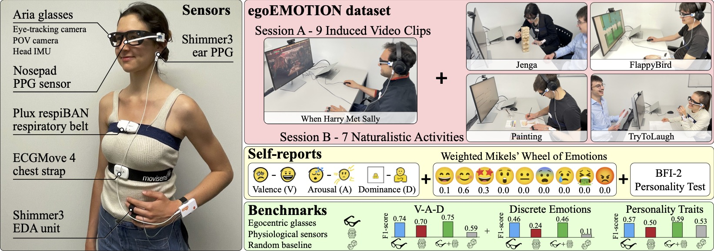
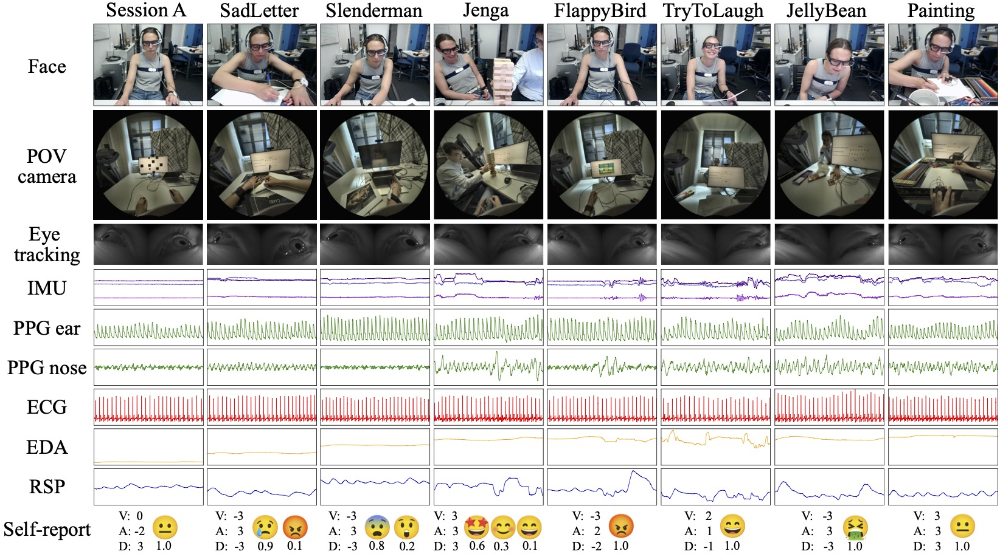

# egoEmotion - NeurIPS 2025

This repository contains the python implementation of all code for the paper "egoEMOTION: Egocentric Vision and Physiological Signals for Emotion and Personality Recognition in Real-world Tasks". 
We provide code for the entire synchronization, preprocessing and baselines for predicting a person's valence, arousal, dominance, emotions and personality on our dataset "egoEMOTION".

## Requirements
All used packages are specified in the environment.yml file.  Install via "conda env create -f environment.yml". Python version 3.11.11 was used.  All files have to be run from the source folder.

## Dataset
To download the dataset, please visit the following link: [egoEMOTION Dataset](https://polybox.ethz.ch/index.php/s/LSKXPye8rGJPHMj).
You will need to sign a form and agree to the terms of use. After that, you will receive a download link via email. The dataset is around 220GB in size.
The dataset is only for non-commercial research purposes.

## Running the code
The folder *source* contains the code. Everything is running using the **main.py** file and the usage of **main.py** is explained in the file itself.
You can choose between different options for:

1) Signal processing-based approaches: 6 different feature selection methods, 3 scaling methods, and 7 different classifiers.
2) Deep learning-based approaches: 2 different architectures (one classical CNN and one transformer-based architecture).
3) The prediction target (valence, arousal, dominance, emotions, or personality).
4) Choose which modalities (ECG, EDA, RR, Pupils, IMU from the head, pixel intensity, Fisherfaces, micro-expressions, gaze, and nose PPG) you want to use for the prediction. You can also combine multiple modalities flexibly.

You only have to run the feature calculation once at the beginning and can then specify to use the pre-calculated features. Depending on your setup, mind to specify how many processes to use for the feature calculation.

## Dataset overview

## Signal overview

